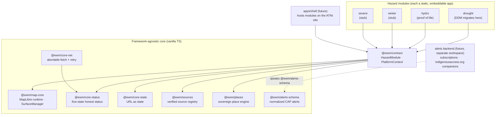

# EWM Architecture

The Extreme Weather Monitor is a family of hazard modules — drought, hydro, winter,
severe — that share one contract, one map runtime, and one set of core services. The
architecture is inherited from the Dynamic Drought Module (DDM), which proved the
pattern in production; these are platform invariants, not preferences.

## System shape

Dependency rules, enforced by review:

1. Core packages never import from modules or the shell.
2. `@ewm/contract` imports **types only** from core packages.
3. `maplibre-gl` is imported in exactly one package: `@ewm/map-core`.
4. Modules reach the outside world only through `PlatformContext` and `@ewm/core-net`.

## The eight invariants

### 1. Serverless-static first

Every module is deployable as a static folder behind a CDN. No server is required to
view maps. Anything that genuinely needs a server (alert subscriptions, notification
fan-out) lives in a future, separate backend workspace and is optional at deploy time.
A Nation must be able to host EWM on any static host it controls.

### 2. TypeScript everywhere

Strict mode (see `tsconfig.base.json`: `strict`, `noUncheckedIndexedAccess`,
`exactOptionalPropertyTypes`). No second language in this repo — data pipelines that
need other tooling live in their own repos and deliver static artifacts.

### 3. MapLibre GL is the map runtime

No proprietary tile providers, no tracking, no API keys required to render a map.
Self-hosted vector/raster data ships as PMTiles (ADR-0002). The OSM raster basemap in
the registry is a development convenience only — its record says so.

### 4. URL as state

Any view a user composes must be shareable as a URL. Serialization lives in
`@ewm/core-state`, not per-module, so a hydro URL and a drought URL follow the same
grammar (`c`, `z`, `s`, `e` + namespaced module params).

### 5. Honest status

Every data layer surfaces one of five states — `live / cached / stale / degraded /
unavailable` — with an "as of" timestamp. The rule is structural: `@ewm/core-status`
**throws** if a data-bearing state is reported without `asOf`. No layer ever silently
pretends to be current.

### 6. Sovereign empty-placeholder pattern

Tribal boundaries, community indicators, and any Nation-specific data ship as empty,
documented placeholder structures (`@ewm/places`) that each deploying Nation populates
in its own deployment. The platform never bundles or phones home sovereign data.
Details and the provenance gate: [DATA_SOVEREIGNTY.md](DATA_SOVEREIGNTY.md).

### 7. Verified source registry

Every external endpoint is a `SourceRecord` in `@ewm/sources`: owner, license, cadence,
region (`us`/`ca`/`both`), and the date a human last verified all of that. No ad-hoc
fetch URLs in module code — `SourceRegistry.get()` throwing on unknown ids is the
enforcement point. See "Source verification" below.

### 8. Framework-agnostic core

Core packages are vanilla TS with zero UI-framework dependency. The shell may adopt
React later; modules must remain embeddable anywhere (an iframe on Squarespace, a div
on the ATNI site, a kiosk). This is why `MapRuntime` is an interface and why the status
pill in hydro is 30 lines of DOM code rather than a component library.

## Source verification

A new external endpoint enters the registry only through this process:

1. **Propose** — open a PR adding the `SourceRecord` with every field filled in, plus a
   note on why this source (authority, coverage, latency) and what happens when it is
   down.
2. **Verify** — a human confirms the URL responds, the license permits our use and
   redistribution model, the cadence claim matches observed behavior, and the owner is
   the authoritative operator (not a mirror). Set `verifiedAt` to that date.
3. **Wire** — modules reference the record by `sourceId` in their declarations. The
   fetch itself goes through `@ewm/core-net` so failures surface as honest status.
4. **Re-verify** — `verifiedAt` older than 12 months is a flag; CI tooling for this is
   future work (ROADMAP).

US/CA parity note: for every US source we adopt, record the Canadian counterpart (or
its absence) in the record's `notes` — First Nations coverage is a first-class
requirement, not a port.

## Windows note

This repo is developed on Windows and CI runs Linux; both must stay green. Practical
consequences: npm scripts are cross-platform (no bash-isms), line endings are
normalized to LF via `.gitattributes`, and paths in code always use forward slashes.
